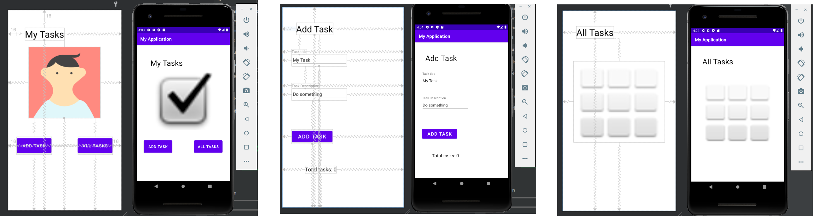
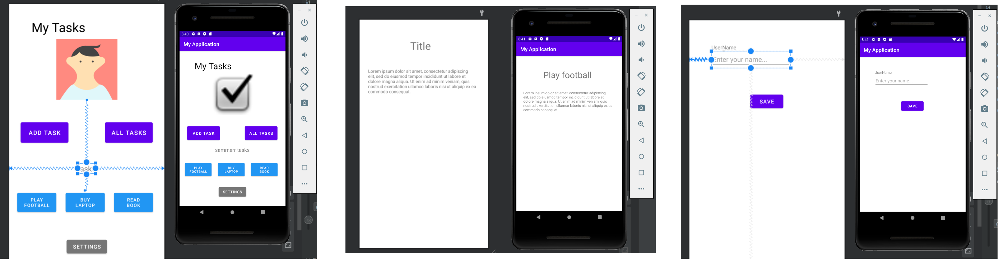
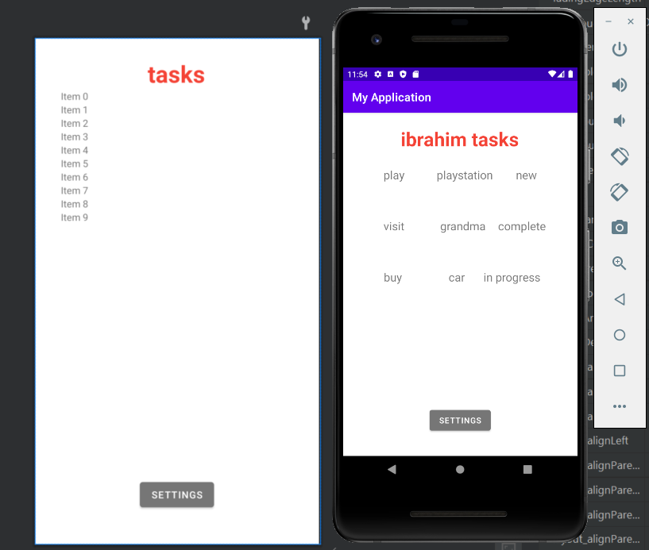
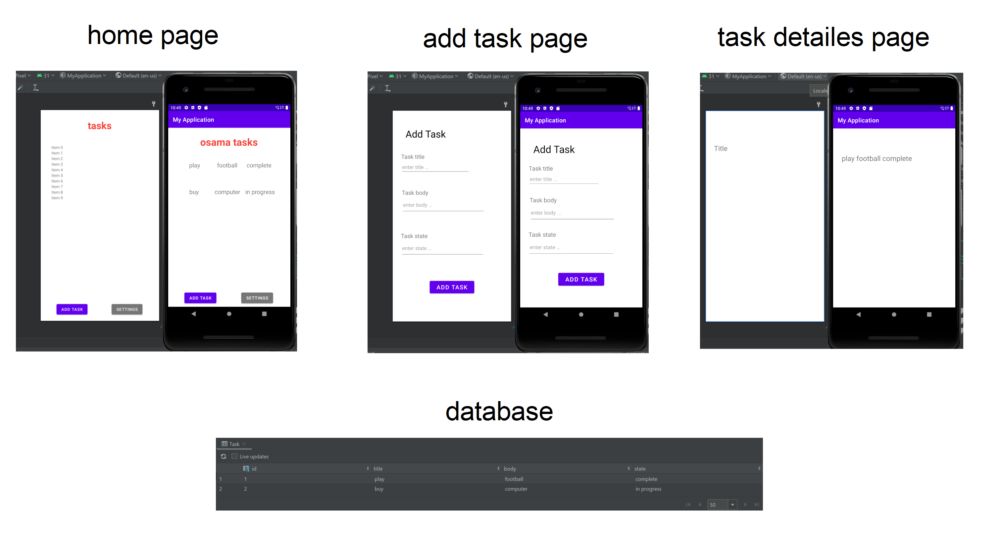

# taskmaster

- Lab26 >> create a homepage and 2 other pages (add task , all tasks), homepage have 2 buttons when click i redirect to the corresponding page.

  

- Lab27 >> add 4 new buttons on the homepage (3 tasks and settings) and other 2 other pages (settings and task detail), now when the user enter his name on the settings page it will appear on the home page tasks title, and when he clicks on any task butoon he will be directed to the task detail page with the title of the task he cliked.

  

- Lab28 >> create a recycler view to show 3 harcoded tasks.

  

- Lab29 >> store Task data in a local database.

  
